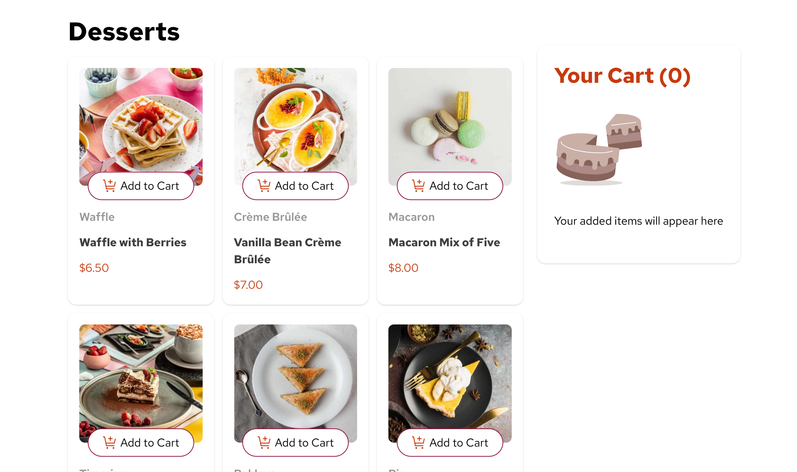
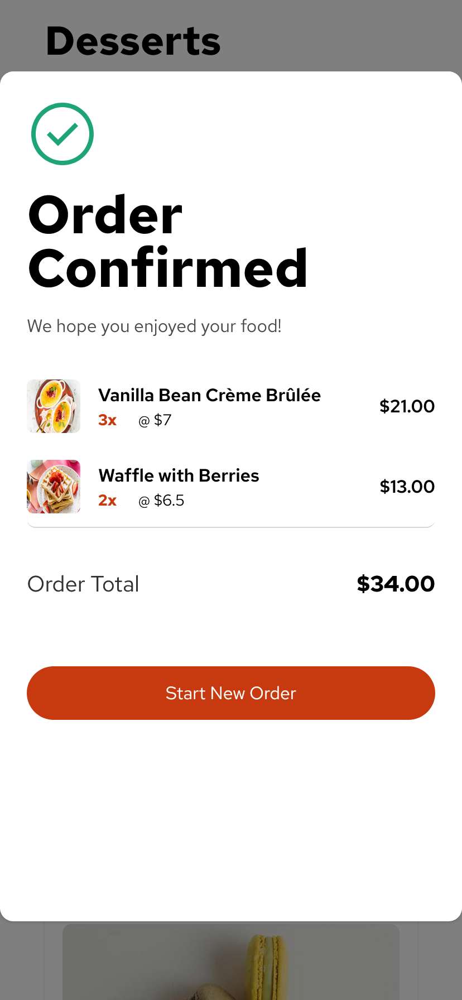
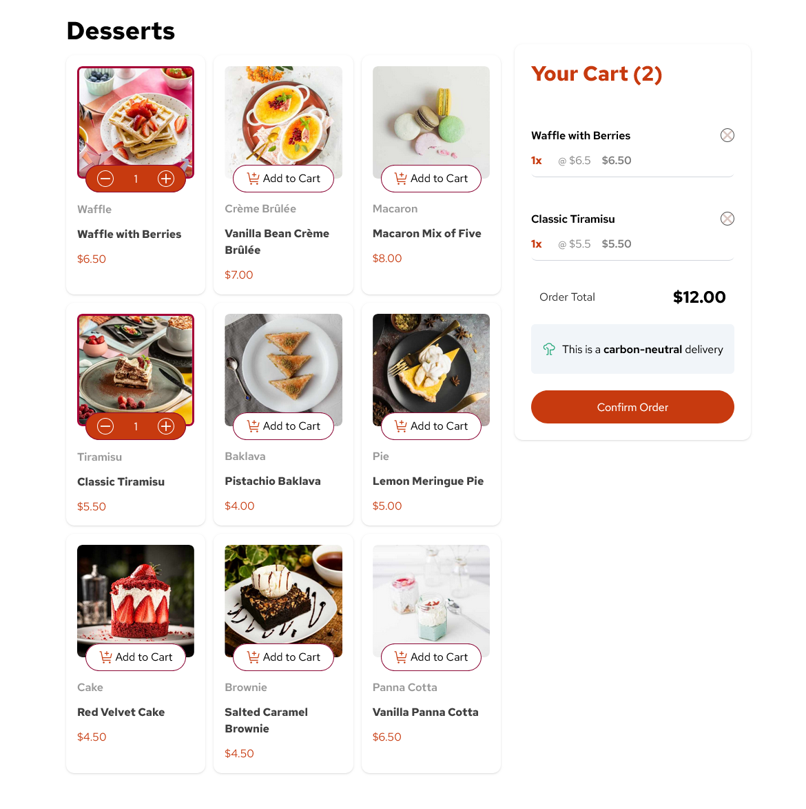
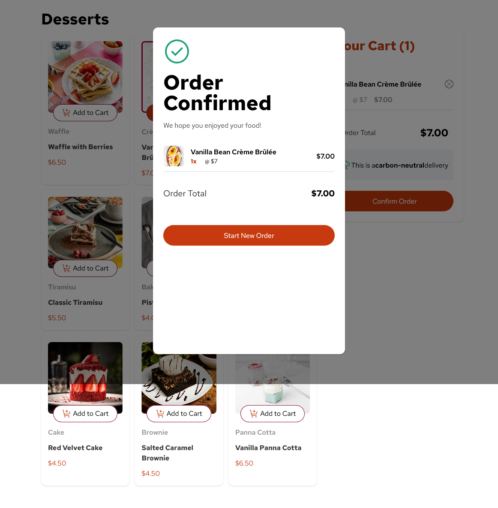
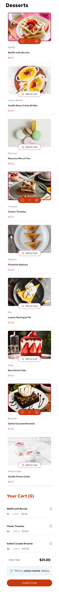
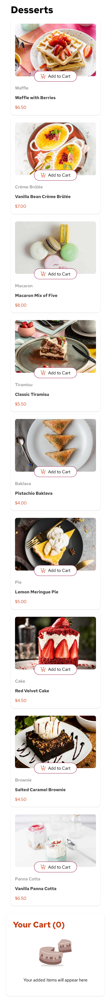
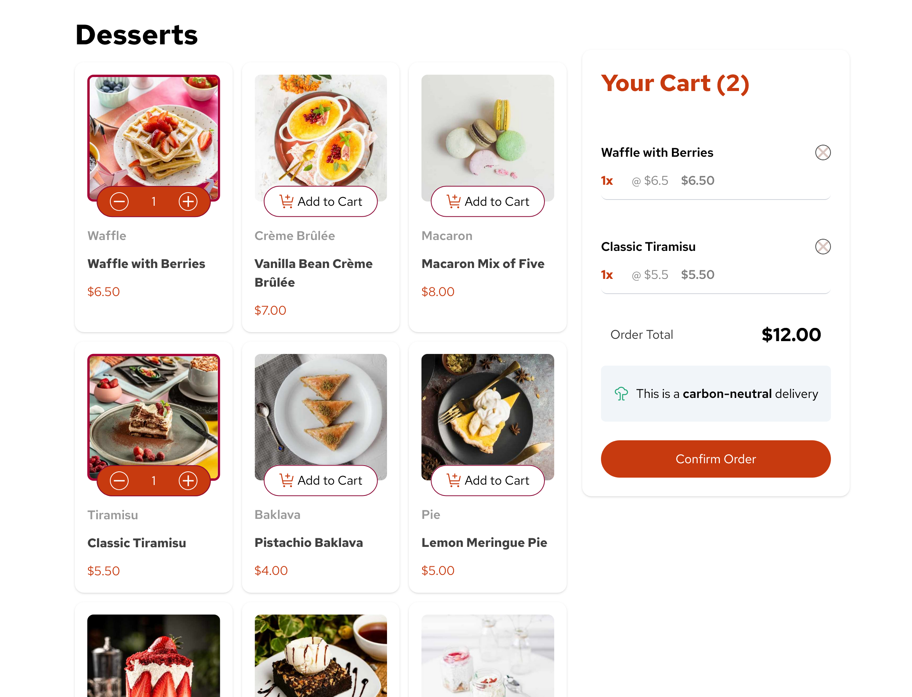

# Frontend Mentor - Product list with cart solution

This is a solution to the [Product list with cart challenge on Frontend Mentor](https://www.frontendmentor.io/challenges/product-list-with-cart-5MmqLVAp_d). Frontend Mentor challenges help you improve your coding skills by building realistic projects. 

## Table of contents

- [Overview](#overview)
  - [The challenge](#the-challenge)
  - [Screenshot](#screenshot)
  - [Links](#links)
- [My process](#my-process)
  - [Built with](#built-with)
  - [What I learned](#what-i-learned)
  - [Continued development](#continued-development)
  - [Useful resources](#useful-resources)
- [Author](#author)
- [Acknowledgments](#acknowledgments)

## Overview

### The challenge

Users should be able to:

- Add items to the cart and remove them
- Increase/decrease the number of items in the cart
- See an order confirmation modal when they click "Confirm Order"
- Reset their selections when they click "Start New Order"
- View the optimal layout for the interface depending on their device's screen size
- See hover and focus states for all interactive elements on the page

### Screenshot










### Links

- Solution URL: (https://github.com/Dev-sadeeq/Product-list)
- Live Site URL:(https://dev-sadeeq.github.io/Product-list/)

## My process

### Built with

-Semantic HTML5
-Tailwind CSS
-Mobile-first workflow
-CSS Grid & Flexbox
-Vanilla JavaScript
-LocalStorage for cart persistence


### What I learned

This project helped me deeply understand state management without frameworks. Managing the cart using plain JavaScript forced me to think more logically about:
-Separating data (cart state) from UI rendering
-Persisting data with localStorage
-Handling edge cases like quantities equal to 1 disappearing on refresh
-Preventing layout issues caused by responsive resizin

One key takeaway was learning where logic should live. Moving cart-related logic into a single source of truth fixed multiple bugs at once.
```js
let cart = JSON.parse(localStorage.getItem('cart')) || [];
mycart.insertBefore(cartItems, mycart.querySelector('.order-total'));
```

### Continued development

In future projects, I want to:
-Improve my approach to responsive layouts at edge breakpoints
-Practice more complex state logic without relying on frameworks
-Refactor this project using a framework (React) for comparison
-Improve accessibility (ARIA roles, keyboard navigation)

### Useful resources

Tailwind CSS Docs: Essential for understanding responsive utilities
MDN Web Docs: LocalStorage – Helped with cart persistence

## Author

- Frontend Mentor - [@Dev-sadeeq](https://www.frontendmentor.io/profile/Dev-sadeeq)
- Twitter - [@Dev_sadeeqq](https://www.twitter.com/Dev_sadeeq)


## Acknowledgments

## Acknowledgements

- This project was built as a hands-on learning exercise to strengthen my understanding of JavaScript state management, DOM manipulation, and responsive layouts.
- Design assets were provided by the Frontend Mentor challenge.
